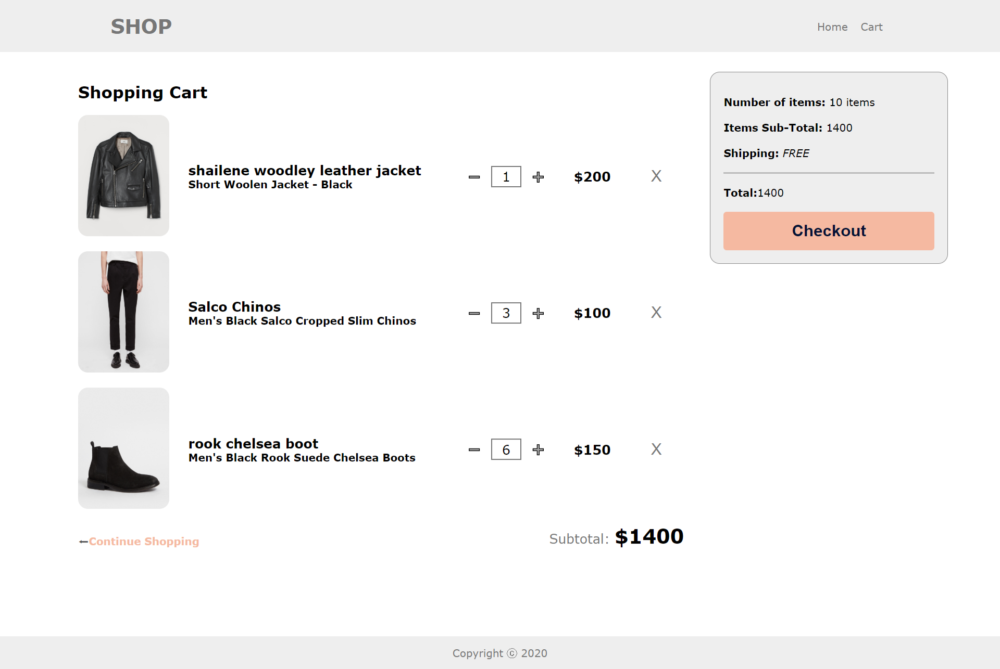
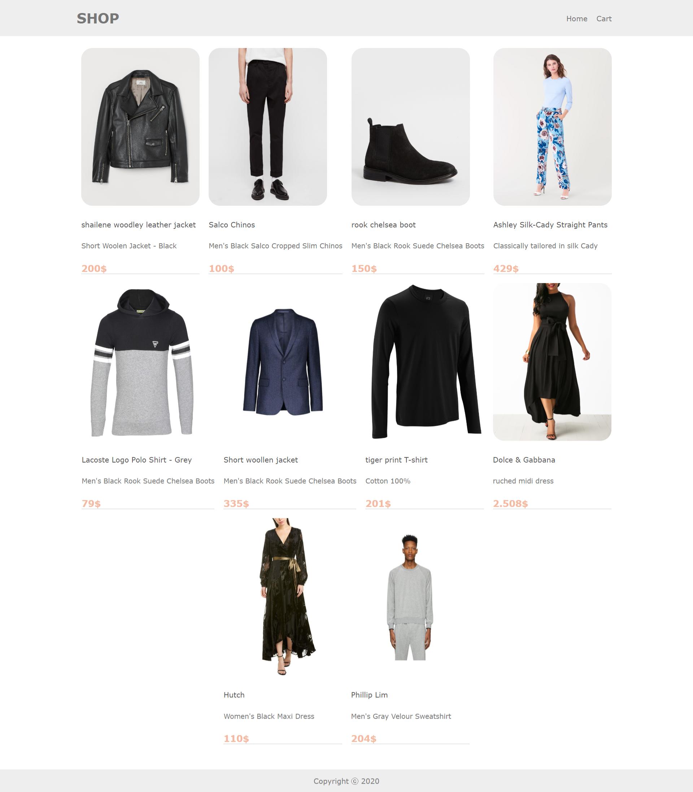
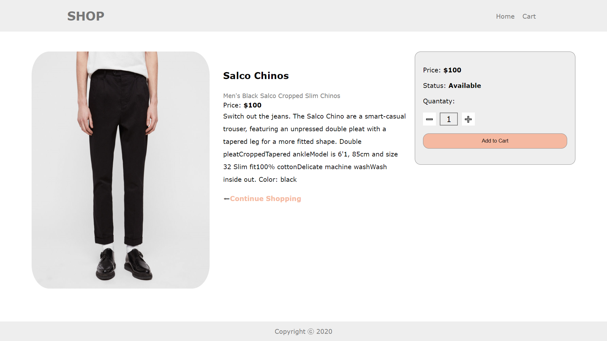

# MERN stack shopping cart



## Description

Shopping cart app build with MERN stack and using RESTful API design. Responsive front-end design, Deployed on Heroku.

## Demo link

View demo <a href="https://york-task.herokuapp.com/"><b>Here 💻</b></a> or go to "Installation and Usage" and follow the instructions to install and use.

## Technologies & Tools

### Front-end:

- React
- Redux
- Axios

### Backend:

- Node
- Express

## Installation and Usage

### Requirements:

- Node.js installed ✔

### Steps:

1. Clone repo on your local machine:

```
$ git clone https://github.com/samirazazy/shopping-card-task.git
```

2. Install dependencies for the server side (in the main file directory) run the server.

```
$ npm install
```

Server now running on `localhost:5000/api/items`

3. Install dependencies for the client side (in the main file directory).

```
$ npm run install-reactjs
```

4. finally 🎉: Run the application

```
$ npm start
```

App now running on `localhost:3000` 💙

### Home Page



### Product page


