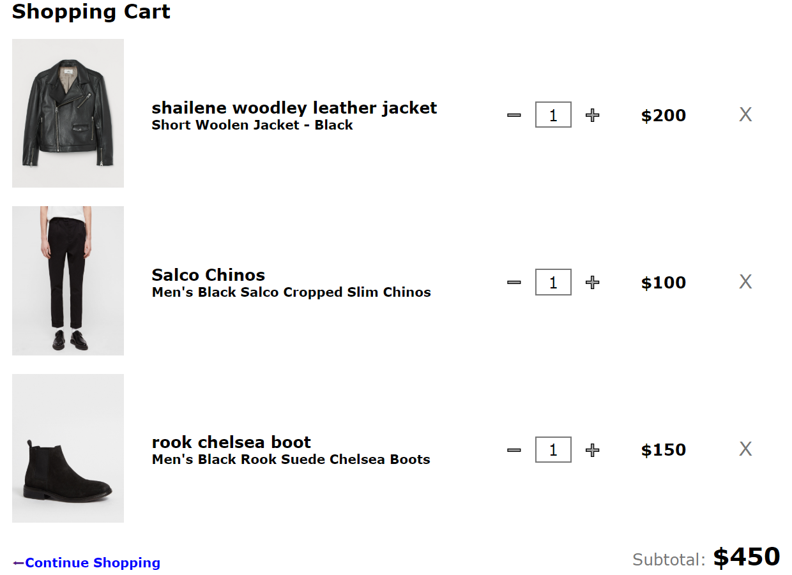

# MERN stack shopping cart



## Description

Shopping cart app build with MERN stack and using RESTful API design. Responsive front-end design, Deployed on Heroku.

<!-- View demo <a href="...">here</a> or go to "Installation and Usage" and follow the instructions to install and use. -->

## Technologies & Tools

### Front-end:

* React
* Redux
* Axios

### Backend:

* Node
* Express

## Installation and Usage

### Requirements:

* Node.js installed

### Steps:
1. Clone repo on your local machine:
```
$ git clone https://github.com/samirazazy/shopping-card-task.git
```
2. Install dependencies in (the main file), (nodejs file) and (reactjs file):
```
$ npm install
```
3. Run The server:
```
$ npm start
```
Server now running on ```localhost:5000```

4. Run client-side dependencies:
```
$ cd reactjs
$ npm start
```
App now running on ```localhost:3000```
